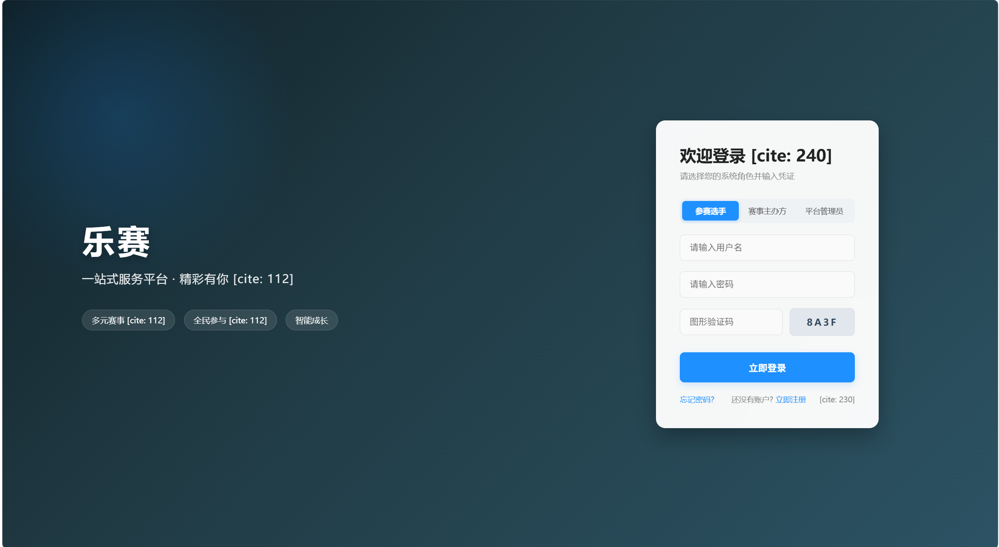
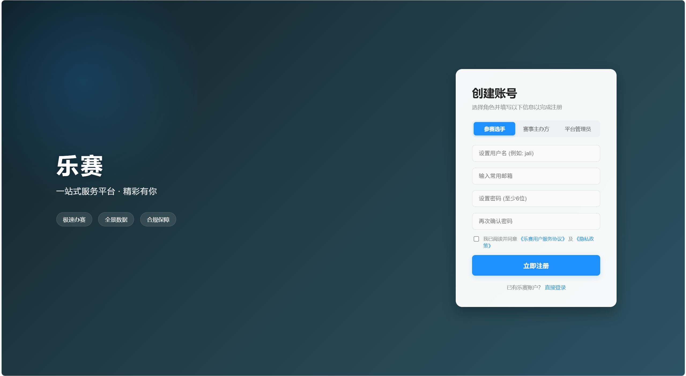
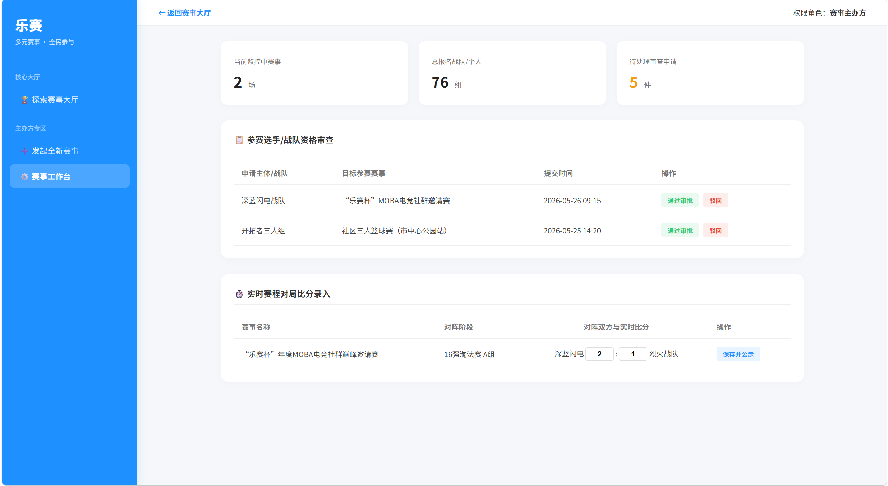
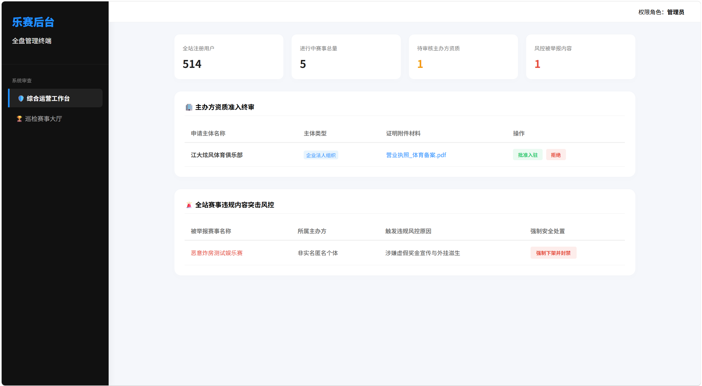
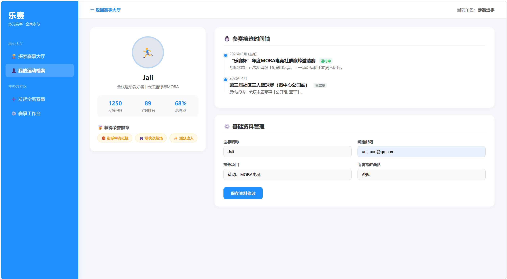

# 乐赛界面截图

本目录用于集中存放当前版本的真实页面截图，便于维护者快速了解主要页面的视觉状态和业务入口。截图文件统一位于 `docs/assets/screenshots/`。

| 页面 | 文件 | 说明 |
| --- | --- | --- |
| 登录页 | `screenshots/login.png` | 登录表单、验证码和动态背景 |
| 注册页 | `screenshots/register.png` | 注册表单和登录页一致的背景风格 |
| 赛事大厅 | `screenshots/hall.png` | 赛事搜索、筛选、卡片与缩图 |
| 主办方工作台 | `screenshots/organizer.png` | 主办方赛事管理入口 |
| 管理员后台 | `screenshots/admin.png` | 审核、用户治理和平台管理 |
| 淘汰树 | `screenshots/tournament.png` | 单淘汰树、节点与轮次布局 |
| 文档/档案页 | `screenshots/document.png` | 信息展示类页面效果 |

## 预览

## 维护要求

- 页面布局、主色调或核心功能入口发生明显变化时，应同步更新对应截图。
- 截图应优先使用真实运行页面，不使用外部宣传图替代。
- 截图文件名保持小写英文，避免系统路径或中文文件名造成链接兼容问题。
